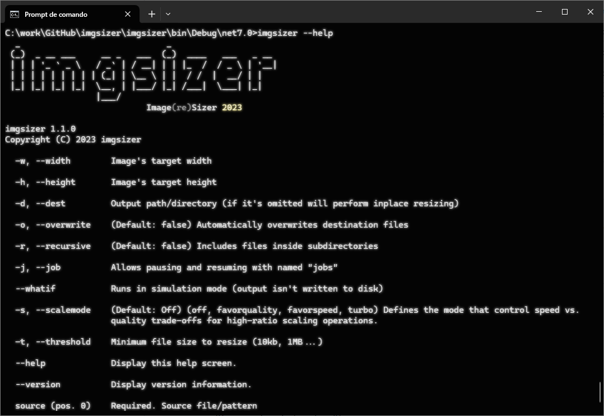

# imgsizer
Image (re)Sizer is a multiplatform .NET application to resize/shrink image files, either inplace or to a destination directory (preserving folder structure). It aims to be very fast and to keep as much image quality as possible. To that end it uses the amazing [PhotoSauce.MagicScaler](https://github.com/saucecontrol/PhotoSauce) high-performance, high-quality image processing pipeline library for .NET.

## Usage
Although there are quite a few parameters, the defaults were selected to provide a very optimized (fast and high quality) result for most use cases and usage is very simple: you normally only need to pass source, destination (or not if resizing inplace) and a maximum width and height.

Command line syntax: `imgsizer source [-flags]`

Full command line: 

`imgsizer [--help] [--version] source [-d destination] [-w width] [-h height] [-o] [-r] [-j job-name [--create-job]] [-m Crop|Contain|Stretch|Pad|Max] [-a Center,Top,Bottom,Left,Right] [--matte-color Color] [--hybrid-mode off|favorquality|favorspeed|turbo] [-t size] [-q 1..100] [-c Subsample420|Subsample422|Subsample444] [-p None|Semi|Full] [--whatif]`

### Basic examples

`imgsizer *.jpg -d resized -w 400 -h 400`

Resizes `*.jpg` images in the current folder into a subfolder named `resized`, constraining their larger dimension to 400 pixels.

`imgsizer img\*.jpg -r -w 400 -h 600`

Resizes `*.jpg` images in the `img` subfolder, recursing its folder structure, constraining the width to 400 pixels and/or height to 600 pixels, maintaining the original aspect-ratio. Performs inplace resizing (overwriting the source files), but asks for confirmation (no `-o|--overwrite` flag passed`).

`imgsizer img\*.jpg -r -w 400 -h 600 -o`

Same as the previous example but does not ask for confirmation to overwrite source files.

`imgsizer *.jpg -w 400 -h 400 -t 200KB -o`

Resizes `*.jpg` images in the current folder, constraining their larger dimension to 400 pixels, filtering out all images larger than 200 KB (`-t|--threshold` option). Doesn't ask for confirmation to overwrite processed files.

### Full options
```
  _                             _
 (_)  _ __ ___     __ _   ___  (_)  ____   ___   _ __
 | | | '_ ` _ \   / _` | / __| | | |_  /  / _ \ | '__|
 | | | | | | | | | (_| | \__ \ | |  / /  |  __/ | |
 |_| |_| |_| |_|  \__, | |___/ |_| /___|  \___| |_|
                  |___/
                            Image(re)Sizer 2023

imgsizer 1.2.0
Copyright (C) 2023 imgsizer

  -w, --width          Image's target width

  -h, --height         Image's target height

  -d, --dest           Output path/directory (if omitted will perform inplace resizing)

  -o, --overwrite      (Default: false) Automatically overwrites destination files

  -r, --recursive      (Default: false) Includes files inside subdirectories

  -j, --job            Allows pausing and resuming with named "jobs"

  --createjob          (Default: false) Only creates the job by enumerating the files to be processed

  -m, --mode           (Default: Max) Specifies the resize/crop scale mode to use (Crop, Contain, Stretch, Pad, Max)

  -a, --anchor         (Default: Center) Specifies the horizontal and vertical anchor positions for auto cropping
                       (Center, Top, Bottom, Left, Right) (pass multiple values separated by commas)

  --matte-color        (Default: Black) Specifies the color to use when padding or converting transparency to
                       non-transparent formats (Use names or values: White; Brown; #FFFFA0; 255,255,160...)

  --hybrid-mode        (Default: Off) Defines the mode that control speed vs. quality trade-offs for high-ratio scaling
                       operations (off, favorquality, favorspeed, turbo)

  -t, --threshold      Minimum file size to resize (10kb, 1MB...)

  -q, --quality        (Default: 80) Defines perceptual output quality for lossy compressions (1..100)

  -c, --chroma         (Default: Subsample420) Defines the Chroma Subsample mode to use for encoding

  -p, --progressive    (Default: None) Defines the JPEG Progressive mode to use for enconding

  --whatif             Runs in simulation mode (output isn't written to disk)

  --help               Display this help screen.

  --version            Display version information.

  source (pos. 0)      Required. Source file/pattern
```

#### Advanced Options
`-m | --mode`: Specifies the Crop Scale Mode
* `Crop`: Crops the image to the dimensions specified in -w and -h (centers the crop around the `-a|--anchor` option)
* `Contain`: Contains the image into the dimensions specified, avoiding cropping. Will enlarge smaller images.
* `Stretch`: Stretch the image to the exact dimensions specified. Do not preserve the original aspect-ratio.
* `Pad`: Pads the image (when enlarging) to the exact dimensions specified (uses `--matte-color` for padding in non-transparent image formats)
* `Max` (default): The same as Contain but do not enlarge smaller images.

`--matte-color`: Specifies the color to use when padding and/or for transparent pixels on non-transparent formats. 

You can specify the color in a variety of formats:
* Color name: `Brown`, `Red`, `DarkOliveGreen`, etc. (any .NET valid color name)
* Hex color notation: `#FFA080` without alpha, or `#D0FFA080` with alpha (ARGB)
* Decimal color notation: `255,255,160` without alpha, or `100,255,255,160` with alpha (A,R,G,B). _If using spaces after the commas you must quote the value:_ `"200, 255, 160"`

## Screenshots


